# Campus Course & Records Manager (CCRM)

## Evolution of Java
- 1991: Oak language created by James Gosling at Sun Microsystems
- 1995: Renamed to Java, first public release (Java 1.0)
- 1998: Java 2 (J2SE 1.2) with Swing, Collections Framework
- 2004: Java 5 with Generics, Annotations, Enums
- 2014: Java 8 with Lambda expressions, Stream API
- 2017: Java 9 with Module System
- 2021: Java 17 LTS with Pattern Matching, Records
- 2023: Java 21 LTS with Virtual Threads

## Java Editions Comparison

| Feature | Java ME | Java SE | Java EE |
|---------|---------|---------|---------|
| Target | Mobile/Embedded devices | Desktop applications | Enterprise applications |
| Memory | Limited (KB-MB) | Moderate (MB-GB) | Large (GB+) |
| APIs | Subset of SE | Core Java APIs | Extended APIs (Servlets, JSP, EJB) |
| Use Cases | IoT, Smart cards | Desktop apps, Android | Web servers, Microservices |

## Java Architecture

### JDK (Java Development Kit)
- Complete development environment
- Includes JRE + development tools (javac, javadoc, jar)
- Required for compiling Java code

### JRE (Java Runtime Environment)
- Runtime libraries and JVM
- Required for running Java applications
- Cannot compile code

### JVM (Java Virtual Machine)
- Executes bytecode
- Platform-specific implementation
- Provides memory management, security, portability

### How They Interact:
JDK → contains → JRE → contains → JVM
Source Code → javac (JDK) → Bytecode → JVM → Machine Code

## Installation on Windows
1. Download JDK from Oracle/OpenJDK website
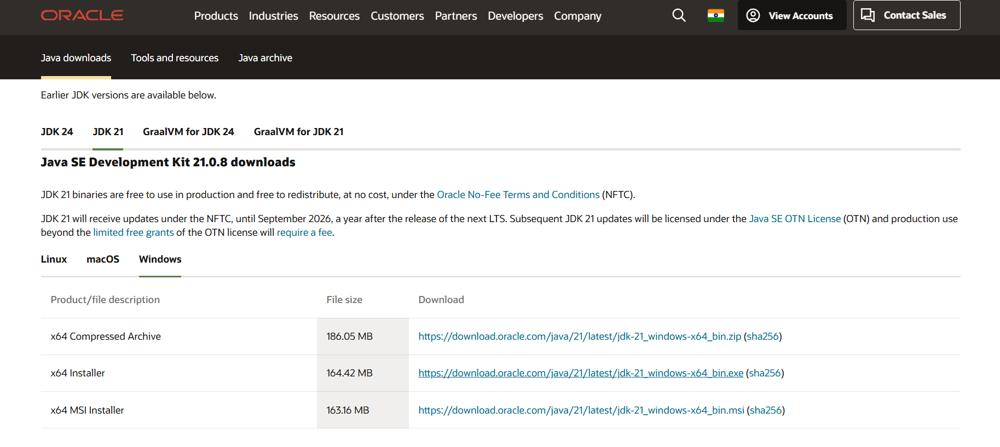
2. Run installer as Administrator
3. Set JAVA_HOME environment variable to JDK path
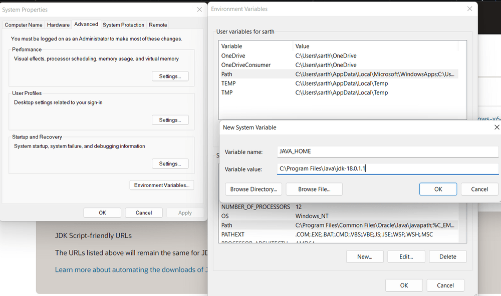
4. Add %JAVA_HOME%\bin to PATH
5. Verify: `java -version` and `javac -version`
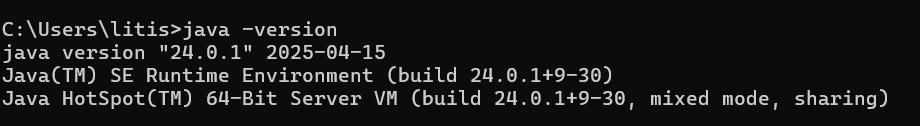

## Eclipse IDE Setup
1. Download Eclipse IDE for Java Developers
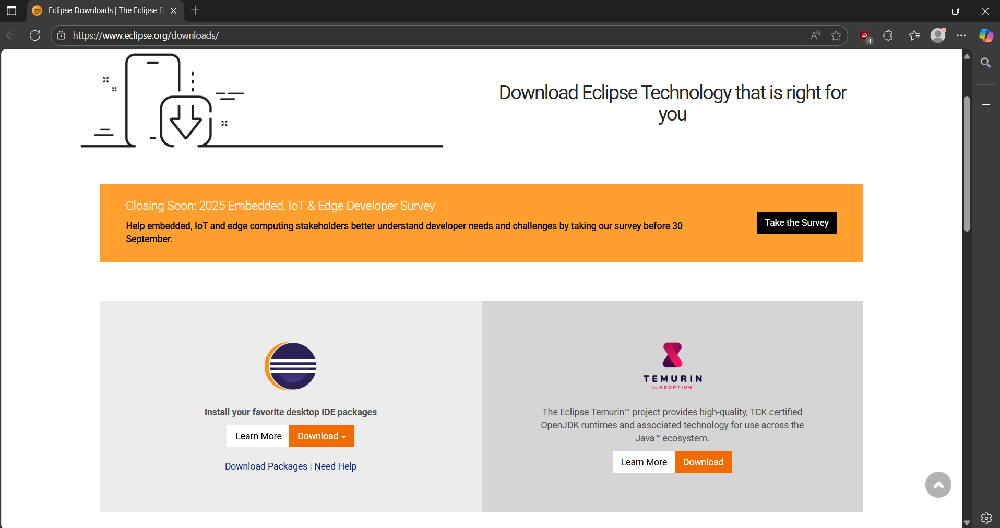
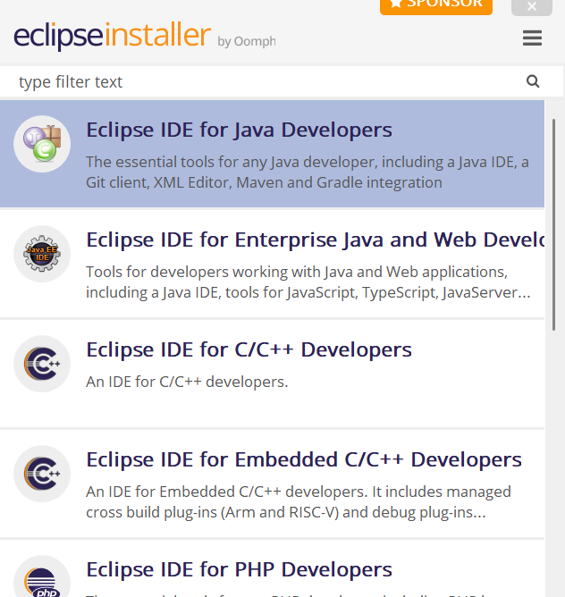
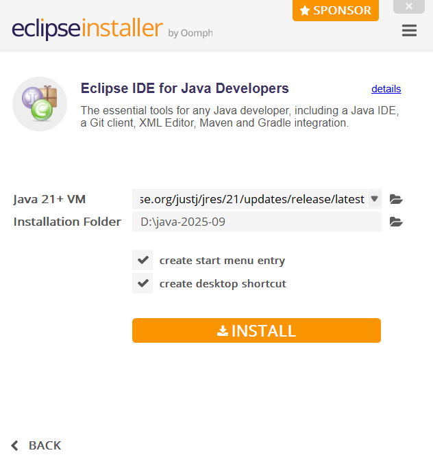
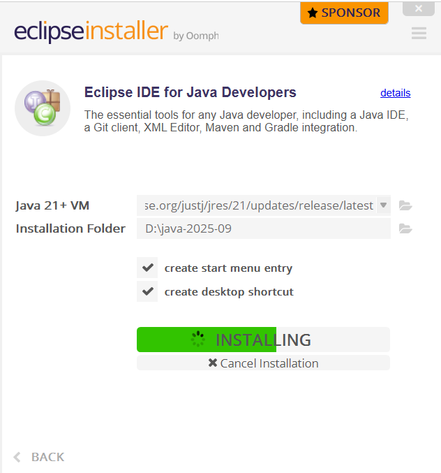
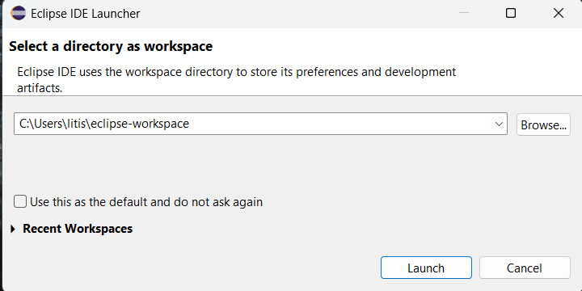
3. File → New → Java Project
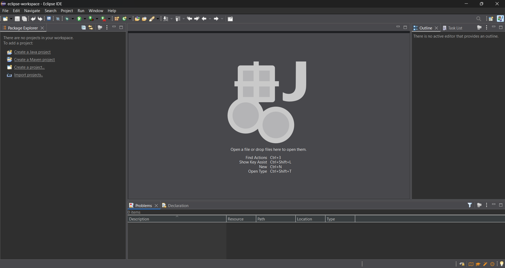
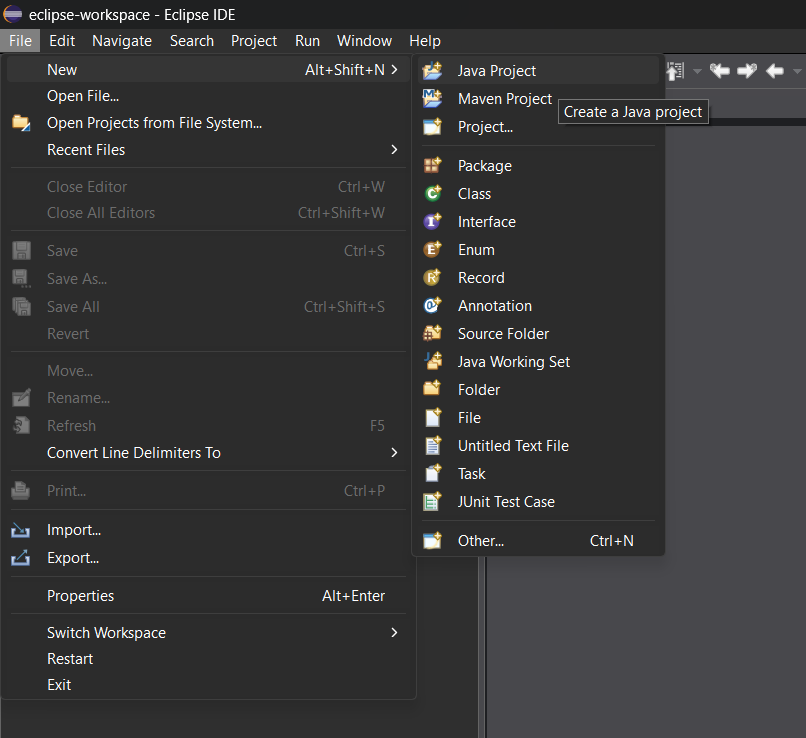
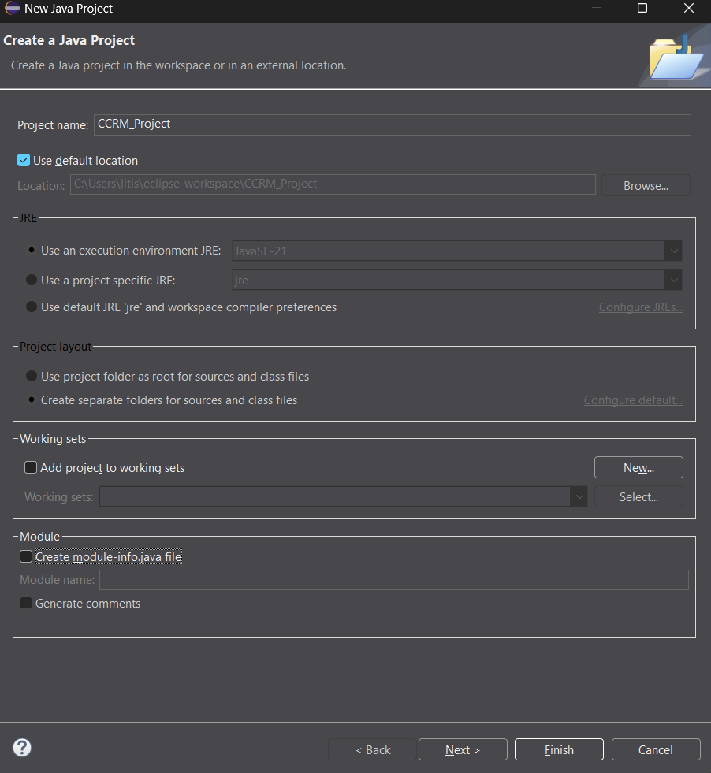
5. Configure Build Path for libraries
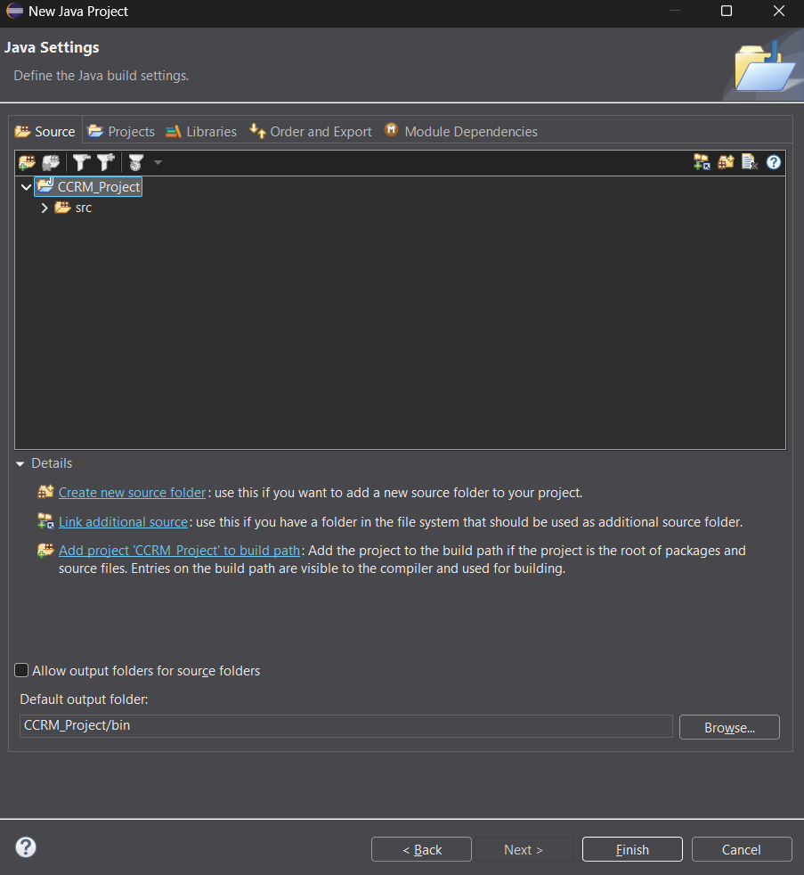
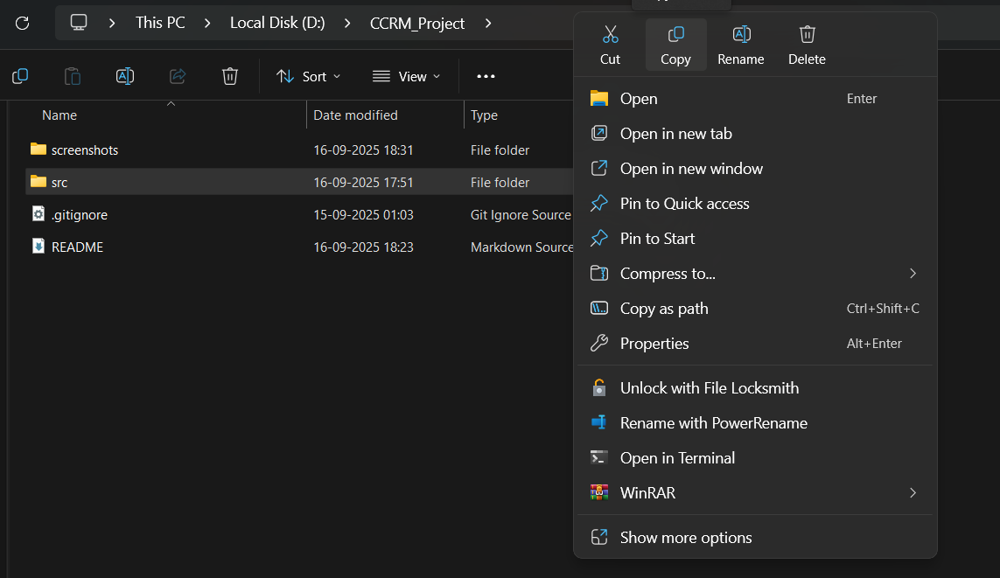
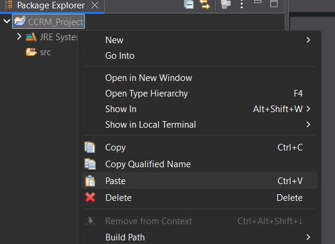
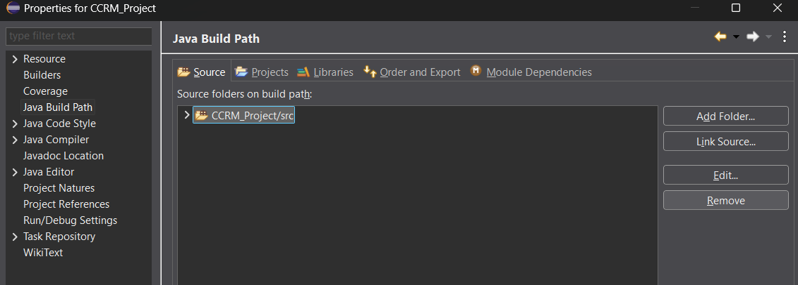
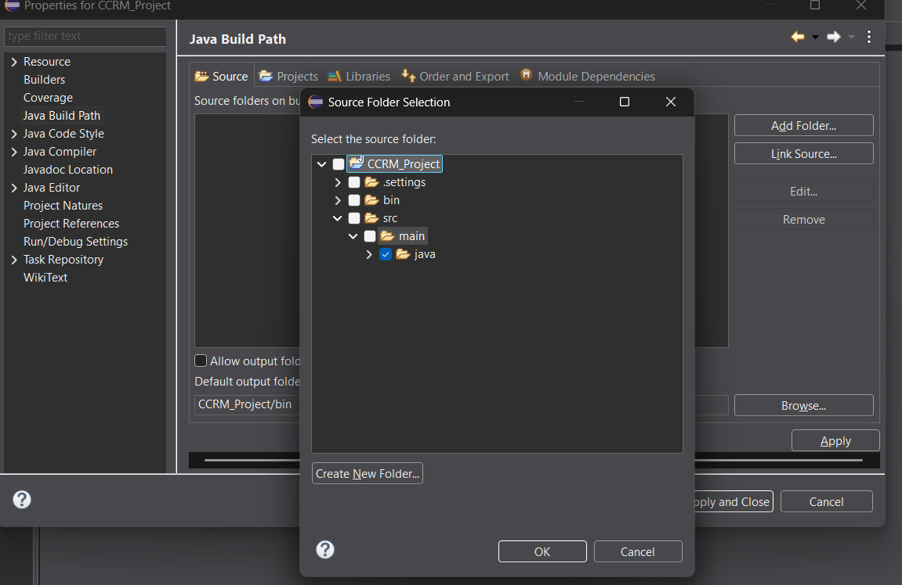
7. Run → Run Configurations → Java Application
8. Select Main class and Run

## Errors vs Exceptions
- **Errors**: Serious problems that applications shouldn't catch (OutOfMemoryError, StackOverflowError)
- **Exceptions**: Conditions that applications might want to catch
  - Checked: Must be handled (IOException)
  - Unchecked: Runtime exceptions (NullPointerException)

## Enabling Assertions
Run with: `java -ea MainClass` or `-enableassertions`

### Author : Kevin George Varghese
### Reg No: 24BCE10489
